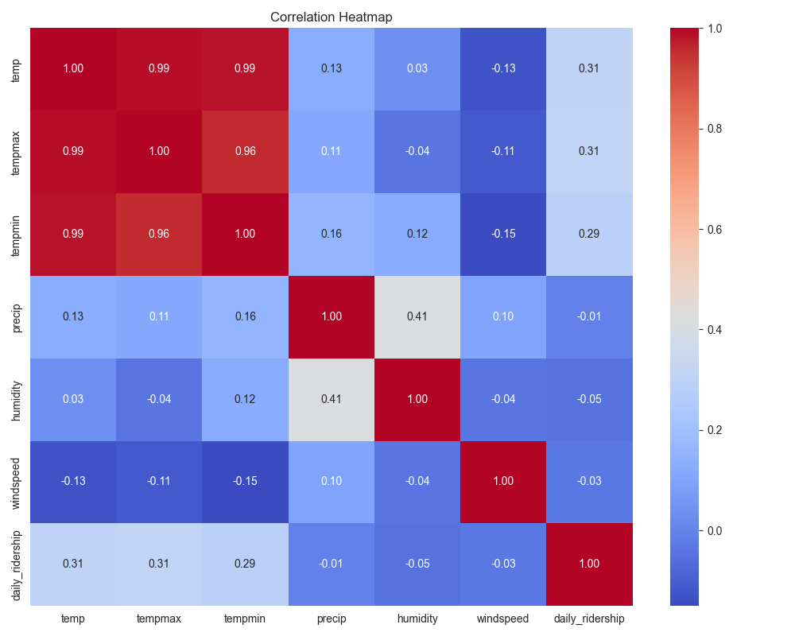

# Weather and Transit ETL

A coursework pipeline joining Chicago weather with daily transit ridership to explore how travel patterns vary with weather. It cleans dates, aggregates ridership by day, joins the sources, and exports a merged CSV and exploratory plots.

## My contribution

I implemented the extraction and transformation modules and wired the pipeline through `main.py`, extending the [course starter](https://github.com/gi11ikin/problem-set-1). The original assignment instructions are retained below.

This is a committed analysis artifact, not a fresh run. Correlations describe the joined sample and do not establish that weather causes changes in ridership.

## Pipeline and outputs

`Weather API + CTA ridership → date cleaning → daily aggregation → join → CSV and charts`

The extraction module assigns identifiers to source rows. The transformation module standardizes dates, sums transit rides by day, and joins them to weather observations. The saved line chart, February precipitation scatter plot, and correlation heatmap answer different exploratory questions; none is a causal estimate.

Review the join and missing dates before interpreting the plots. An inner join retains matching dates, so coverage in the merged dataset can differ from either source.

## Run and inspect

Create a fresh Python environment, install `requirements.txt`, and run `python main.py` from the repository root. Set `VISUAL_CROSSING_API_KEY` in your environment first; the entry point requires it even when the cached CSV files exist. Downloads can be subject to provider limits. Create your own environment rather than reusing the checked-in `.venv`.

Start with [the transformation code](src/transform_load.py), [saved plots](plots/), or [the merged data](data/merged_weather_transit.csv). The extraction covers October 2024 through October 2025; that is the data period, not the project creation date.

Original course assignment

PROBLEM SET #1: ETL Weather and Transit Data

Instructions: 
- Clone the Problem Set 1 code package from GitHub into VS Code
- You should align the code package with your GitHub account 
- This problem set requires you to ETL two datasets: one is weather data and other is transit data
- - Remember to spend some time to get to know the data, its source, and any documentation
- Each of the two .py files in `/src` contain instructions for the exepected code you are to write
- The problem set you turn in needs to fully run from main.py in order to receive credit

Things to remember: 
- Make sure to setup a virtual environment as discussed in the Course Tech Setup lecture. Here's a short article as an additional resource: 
https://www.freecodecamp.org/news/python-requirementstxt-explained/
- All data file outputs (CSV, parquet, JSON, etc.) need to include a unique ID for each entity / row

When you are done:
- Don't forget to set your requirements.txt file using `pip freeze > requirements.txt`
- Commit and push to your GitHub account
- - You should have separate commit messages for each of the two analyses (at the very least)  

Submission: 
You will submit the URL for this repo in your GitHub in ELMS.

Grading: 
We will only run main.py, so make sure that you stucture this correctly and push your final code. We will look at your code, its output, and make sure you've output the correct CSV files. Credit will be given for adhering to the course's Code Standards and Data Standards, using GitHub correctly, and producing the correct output, among other considerations.

---

## Author

**Kenneth Yeaher**  
MS in Human Computer Interaction  
University of Maryland, College Park  

`Python` · `ETL` · `Exploratory Analysis`
