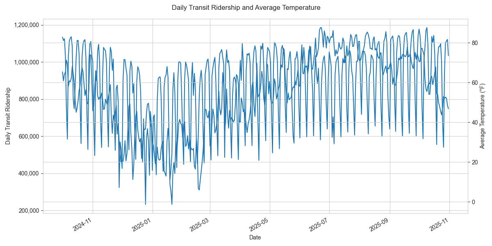

  

  
  

<a href="main.py">Pipeline entry</a> &nbsp; · &nbsp; <a href="src/transform_load.py">Transform and load</a>

## Overview

A course ETL exercise combining Chicago weather and CTA transit ridership. The code extracts source data, standardizes dates, aggregates daily rides, and produces a merged dataset with exploratory plots.

This repository is a personal fork of [the original course repository](https://github.com/gi11ikin/problem-set-1). The original instructions are retained below.

*Existing project output; not regenerated for this README update.*

## At a glance

| Area | What to look for |
| --- | --- |
| **Extract** | Visual Crossing weather and Chicago transit data are written to local CSV files. |
| **Transform** | Date cleaning and daily aggregation prepare the two datasets for an inner join. |
| **Explore** | A time series, precipitation scatterplot, and correlation heatmap examine the merged data. |

## Start here

In an activated Python environment, install `requirements.txt`, set `VISUAL_CROSSING_API_KEY` in your environment, and run `python main.py` from the repository root. The entry point checks for the key even when cached CSVs are present.

## Scope

Source retrieval requires network access and may be subject to API limits. The plots describe associations, not causal effects. Use a fresh environment rather than the environment files tracked in this coursework repository.

---

<strong>Original course instructions</strong>

PROBLEM SET #1: ETL Weather and Transit Data

Instructions: 
- Clone the Problem Set 1 code package from GitHub into VS Code
- You should align the code package with your GitHub account 
- This problem set requires you to ETL two datasets: one is weather data and other is transit data
- - Remember to spend some time to get to know the data, its source, and any documentation
- Each of the two .py files in `/src` contain instructions for the exepected code you are to write
- The problem set you turn in needs to fully run from main.py in order to receive credit

Things to remember: 
- Make sure to setup a virtual environment as discussed in the Course Tech Setup lecture. Here's a short article as an additional resource: 
https://www.freecodecamp.org/news/python-requirementstxt-explained/
- All data file outputs (CSV, parquet, JSON, etc.) need to include a unique ID for each entity / row

When you are done:
- Don't forget to set your requirements.txt file using `pip freeze > requirements.txt`
- Commit and push to your GitHub account
- - You should have separate commit messages for each of the two analyses (at the very least)  

Submission: 
You will submit the URL for this repo in your GitHub in ELMS.

Grading: 
We will only run main.py, so make sure that you stucture this correctly and push your final code. We will look at your code, its output, and make sure you've output the correct CSV files. Credit will be given for adhering to the course's Code Standards and Data Standards, using GitHub correctly, and producing the correct output, among other considerations.

